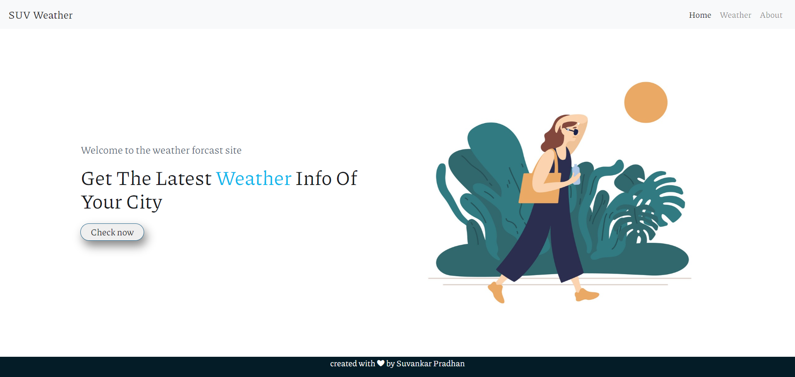
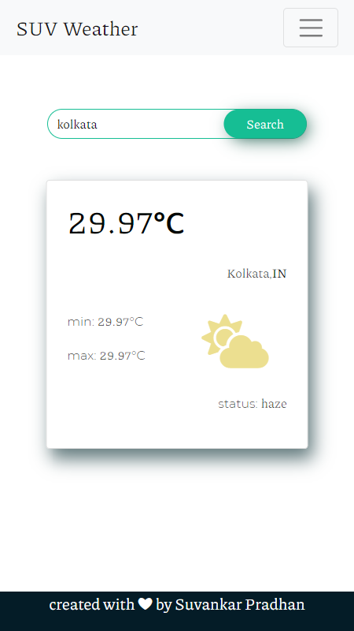

# weather_app

This is a simple project based on node js and API call.

## Table of contents

- [Overview](#overview)
  - [Features](#Features)
  - [Screenshot](#screenshot)
  - [Links](#links)
- [My process](#my-process)
  - [Built with](#built-with)
- [Author](#author)

## Overview

This is a small weather site, where anyone can see basic weather information of any city.

### Features

Users should be able to:

- View weather info of any city
- View the optimal layout for the component depending on their device's screen size

### Screenshot

### Links

- Solution URL: [click here](https://github.com/suvankarpradhan/weather_app)
- Live Site URL: [click here](http://suv-weather-info.herokuapp.com/)

## My process

- Use node js for backend implementation
- Use Express js for routing
- Use API to fetch information on weather.

### Built with

- Semantic HTML5 markup
- CSS custom properties
- Bootstrap
- Custom javascript
- Node
- Express
- API

## Author

- Frontend Mentor - [@suvankarpradhan](https://www.frontendmentor.io/profile/suvankarpradhan)
- github - [@suvankarpradhan](https://github.com/suvankarpradhan)
